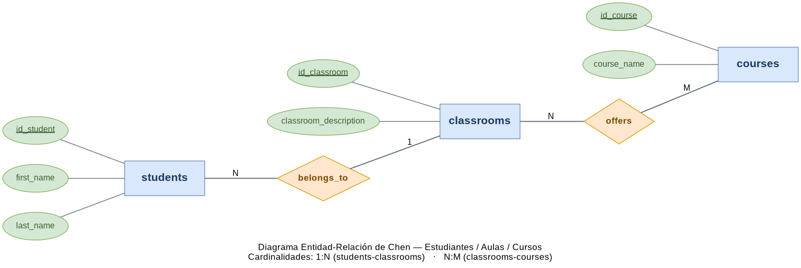
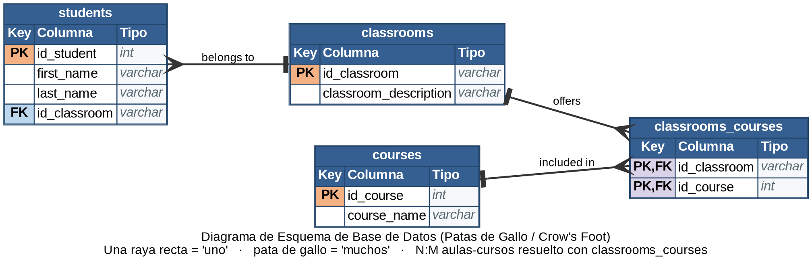
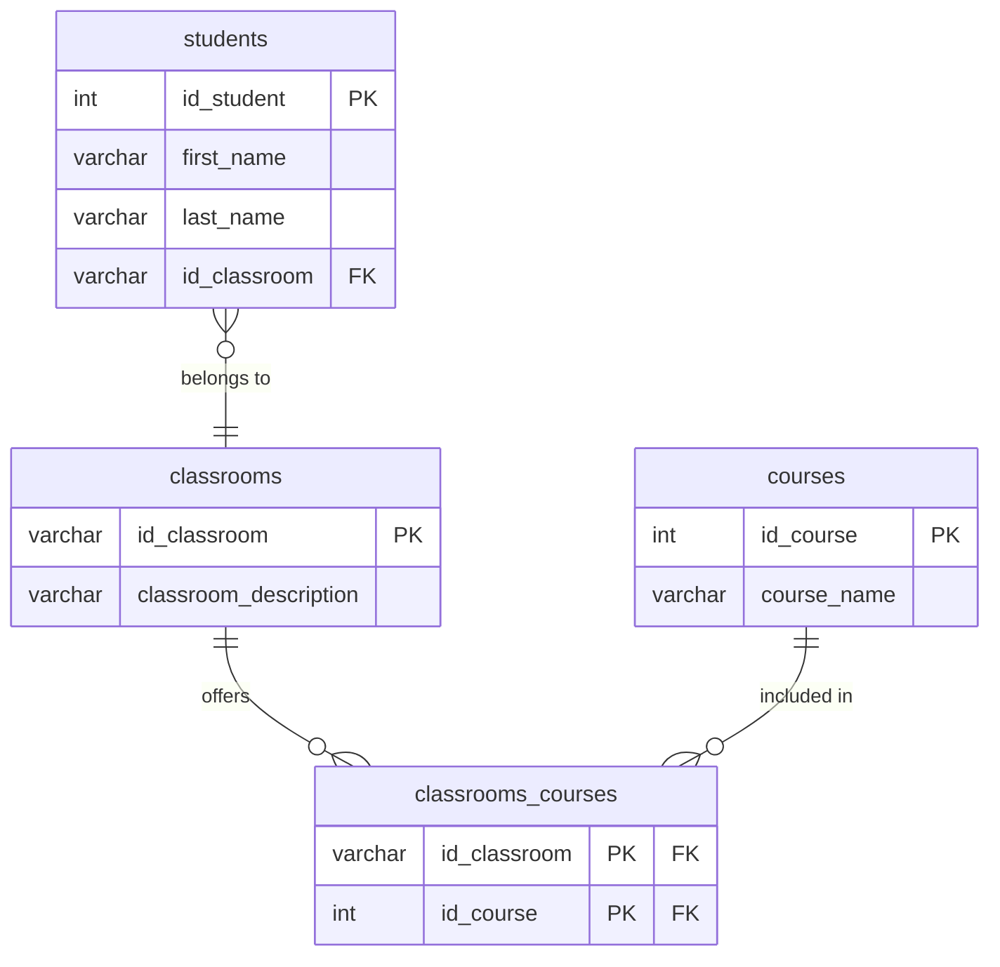

# Normalización de una base de datos — Estudiantes, Aulas y Cursos

> Ejercicio de normalización de una tabla no normalizada, llevada hasta la Tercera Forma Normal (3FN), con su correspondiente diagrama Entidad-Relación de Chen y su diagrama de esquema físico en notación de patas de gallo (Crow's Foot).

---

## Índice

- [Descripción del ejercicio](#descripción-del-ejercicio)
- [Tabla original (sin normalizar)](#tabla-original-sin-normalizar)
- [Cómo pedía normalizar el profesor](#cómo-pedía-normalizar-el-profesor)
- [Proceso de normalización](#proceso-de-normalización)
- [Modelo final (3FN)](#modelo-final-3fn)
- [Relaciones del modelo](#relaciones-del-modelo)
- [Claves primarias y foráneas](#claves-primarias-y-foráneas)
- [Diagrama Entidad-Relación (modelo de Chen)](#diagrama-entidad-relación-modelo-de-chen)
- [Diagrama de esquema de base de datos (patas de gallo / Crow's Foot)](#diagrama-de-esquema-de-base-de-datos-patas-de-gallo--crows-foot)
- [Estructura del repositorio](#estructura-del-repositorio)
- [Herramientas utilizadas](#herramientas-utilizadas)
- [Recursos](#recursos)
- [Autor](#autor)

---

## Descripción del ejercicio

El objetivo es partir de una tabla sin normalizar que registra estudiantes, el aula en la que están matriculados y los cursos (lenguajes de programación) que se imparten en esa aula, y aplicar la Primera, Segunda y Tercera Forma Normal (1FN, 2FN, 3FN) hasta obtener un modelo relacional sin redundancias ni dependencias incorrectas.

Los requisitos del ejercicio son:

1. Normalizar la tabla proporcionada (1FN → 2FN → 3FN).
2. Realizar un diagrama Entidad-Relación de Chen (modelo conceptual).
3. Realizar un diagrama UML de esquema de base de datos en notación de patas de gallo (Crow's Foot), con diagrams.net.
4. Documentar todo el proceso en este README.

**Dato clave del enunciado:** *"Los lenguajes de programación dependen del aula"*. Es decir, todos los estudiantes de una misma aula cursan exactamente los mismos lenguajes — el curso no depende del estudiante, sino del aula en la que está matriculado. Esta pista es la que determina cómo se resuelve la normalización.

---

## Tabla original (sin normalizar)

| id_student | name_student   | classroom | classroom_description | course1 | course2          | course3    |
| :--------: | :------------- | :-------- | :--------------------- | :------ | :--------------- | :--------- |
| 1          | Ana Martínez   | A101      | Web Frontend            | HTML    | CSS               | JavaScript |
| 2          | Luis Fernández | A102      | Web Backend             | Java    | Spring Framework  | SQL        |
| 3          | Carla Gómez    | A101      | Web Frontend            | HTML    | CSS               | JavaScript |
| 4          | Diego López    | A103      | Desarrollo Mobile       | Kotlin  | Swift             | Dart       |
| 5          | Marta Sánchez  | A102      | Web Backend             | Java    | Spring Framework  | SQL        |
| 6          | Javier Torres  | A101      | Web Frontend            | HTML    | CSS               | JavaScript |
| 7          | Laura Ruiz     | A103      | Desarrollo Mobile       | Kotlin  | Swift             | Dart       |
| 8          | Pablo Ramírez  | A102      | Web Backend             | Java    | Spring Framework  | SQL        |
| 9          | Sofía Navarro  | A101      | Web Frontend            | HTML    | CSS               | JavaScript |
| 10         | Tomás Ortega   | A103      | Desarrollo Mobile       | Kotlin  | Swift             | Dart       |

Problemas que presenta esta tabla:

- **Atributo compuesto:** `name_student` mezcla nombre y apellido en un único campo.
- **Grupos de repetición:** `course1`, `course2`, `course3` son columnas fijas para un mismo tipo de dato (curso), lo que obliga a añadir columnas si un aula tuviera más lenguajes y generaría celdas vacías si tuviera menos.
- **Dependencia transitiva:** `classroom_description` no depende de `id_student`, sino de `classroom`; se repite de forma redundante para cada estudiante del aula.

---

## Cómo pedía normalizar el profesor

El propio enunciado incluye el recordatorio con el criterio que el profesor pidió seguir para llegar a la 3FN:

**1FN**

- Las tablas deben tener una clave primaria.
- Los campos deben ser atómicos.
- No debe existir variación en el número de columnas.
- No deben existir campos nulos.
- Identificar los grupos de repetición y separarlos en tablas individuales.

**2FN**

- Cumplir la 1FN.
- Identificar dependencias funcionales y transitivas.
- Separar en tablas independientes.

**3FN**

- Cumplir la 2FN.
- Eliminar los campos que no dependen de la clave primaria (dependencias transitivas).

Se recomendaba además usar Google Sheets para hacer el proceso paso a paso; aquí se ha resuelto con el mismo enfoque en el Excel [`docs/database-normalization.xlsx`](docs/database-normalization.xlsx) (hojas `0-Sin normalizar`, `1FN`, `2FN`, `3FN`).

---

## Proceso de normalización

### 1FN — Atributos atómicos y sin grupos de repetición

- Se separa `name_student` en `first_name` y `last_name`.
- Se elimina el grupo de repetición `course1/course2/course3` convirtiendo cada curso en una fila independiente asociada al estudiante. Cada estudiante pasa a tener 3 filas (una por curso), y la clave de esa tabla intermedia es la combinación `(id_student, course_name)`.

Resultado: tabla atómica y sin columnas repetidas, pero con mucha redundancia (el aula, su descripción y el nombre del curso se repiten en cada fila).

### 2FN — Eliminar dependencias parciales

Sobre la clave compuesta `(id_student, course_name)` de la tabla 1FN:

- `first_name`, `last_name`, `classroom` y `classroom_description` dependen **solo de `id_student`** (una parte de la clave), no de la clave completa → dependencia parcial → se extraen a una tabla `students`.
- `course_name` en realidad no depende del estudiante, sino del **aula** (recordemos: *"los lenguajes dependen del aula"*) → se agrupa en una tabla puente `classroom_courses (classroom, course_name)`, que ya no depende en absoluto de qué estudiante curse ese aula.

Resultado: `students (id_student, first_name, last_name, classroom, classroom_description)` + `classroom_courses (classroom, course_name)`.

### 3FN — Eliminar dependencias transitivas

- En `students`, `classroom_description` depende de `classroom`, y `classroom` depende de `id_student`: es una dependencia transitiva. Se traslada a una entidad propia `classrooms (id_classroom, classroom_description)`, y `students` se queda solo con la clave foránea `id_classroom`.
- `course_name` se convierte en un catálogo `courses (id_course, course_name)` con clave sustituta, evitando repetir el texto del lenguaje en cada fila. La tabla puente pasa a llamarse `classrooms_courses (id_classroom, id_course)`, con clave primaria compuesta por ambas claves foráneas — resolviendo la relación N:M entre aulas y cursos.

El detalle completo, fila a fila, está en el Excel: [`docs/database-normalization.xlsx`](docs/database-normalization.xlsx).

---

## Modelo final (3FN)

1. **`students`** — datos únicos de cada estudiante.
   - `id_student` (PK)
   - `first_name`
   - `last_name`
   - `id_classroom` (FK)

2. **`classrooms`** — catálogo de aulas y su especialidad.
   - `id_classroom` (PK)
   - `classroom_description`

3. **`courses`** — catálogo de lenguajes/cursos.
   - `id_course` (PK)
   - `course_name`

4. **`classrooms_courses`** — tabla puente que resuelve la relación N:M entre aulas y cursos.
   - `id_classroom` (PK, FK)
   - `id_course` (PK, FK)

## Relaciones del modelo

- Un **estudiante** pertenece a **un único aula**; un **aula** puede tener **muchos estudiantes** → relación 1:N (`students` – `classrooms`).
- Un **aula** imparte **muchos cursos**, y un **curso** puede impartirse en **varias aulas** → relación N:M (`classrooms` – `courses`), resuelta mediante `classrooms_courses`.

## Claves primarias y foráneas

| Tabla                 | Clave primaria               | Clave(s) foránea(s) |
| ---------------------- | ----------------------------- | -------------------- |
| `students`             | `id_student`                  | `id_classroom`        |
| `classrooms`           | `id_classroom`                | —                     |
| `courses`              | `id_course`                   | —                     |
| `classrooms_courses`   | `id_classroom`, `id_course`   | Ambas                 |

---

## Diagrama Entidad-Relación (modelo de Chen)

Modelo conceptual con entidades, atributos (clave subrayada) y relaciones con su cardinalidad. Creado con [diagrams.net](https://app.diagrams.net/) — fuente editable en [`diagrams/chen-er.drawio`](diagrams/chen-er.drawio).



---

## Diagrama de esquema de base de datos (patas de gallo / Crow's Foot)

Esquema físico con las cuatro tablas, sus columnas, tipos, claves (PK/FK) y relaciones en notación de patas de gallo. Creado con [diagrams.net](https://app.diagrams.net/) — fuente editable en [`diagrams/crowsfoot.drawio`](diagrams/crowsfoot.drawio).



Versión equivalente en Mermaid:



---

## Estructura del repositorio

```text
database-normalization/
├── diagrams/
│   ├── chen-er.drawio
│   └── crowsfoot.drawio
├── docs/
│   └── database-normalization.xlsx
├── images/
│   ├── chen-er.png
│   └── crowsfoot.png
├── README.md
└── .gitignore
```

## Herramientas utilizadas

- **[diagrams.net (draw.io)](https://app.diagrams.net/)** — diagrama Entidad-Relación de Chen y diagrama en notación de patas de gallo (Crow's Foot). Los `.drawio` de este repo se pueden abrir y editar directamente ahí.
- **Excel / Google Sheets** — proceso de normalización paso a paso (1FN → 2FN → 3FN).
- **[Mermaid](https://mermaid.js.org/)** — versión alternativa del diagrama de patas de gallo, renderizable directamente en el README.
- **Git / GitHub** — control de versiones y alojamiento del ejercicio.

## Recursos

- [diagrams.net](https://app.diagrams.net/)
- [Normalización de bases de datos — 1NF, 2NF, 3NF (freeCodeCamp)](https://www.freecodecamp.org/espanol/news/normalizacion-de-base-de-datos-formas-normales-1nf-2nf-3nf-ejemplos-de-tablas/)
- [Cómo crear un diagrama de base de datos (Edraw)](https://www.edrawsoft.com/es/how-to-create-database-diagram.html)
- [Mermaid — Entity Relationship Diagrams](https://mermaid.js.org/syntax/entityRelationshipDiagram.html)

---

## Autor

**Iker** — [@ikerardi-dev](https://github.com/ikerardi-dev)

Proyecto desarrollado en el bootcamp de Factoría F5.
